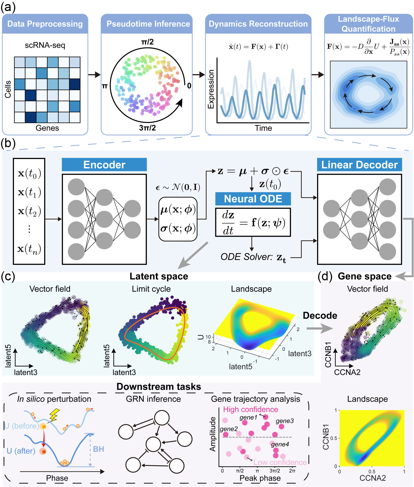

# Reconstructing cellular oscillations from single-cell snapshots by integrating deep learning with landscape theory



## Overview

OsciLand provides a general framework for decoding oscillatory dynamics from static snapshots.  
This repository currently contains code for three experiments:

- `repressilator`: simulation study on the repressilator system
- `44_dim_cell_cycle`: simulation study on a 44-dimensional mammalian cell-cycle model
- `U2OS_scRNA-seq`: analysis of U2OS single-cell RNA-seq data

## Requirements

The code was developed with Python 3.9.19.

Install the required packages with:

```bash
pip install -r requirements.txt
```

For full environment reproduction, please use:

```bash
conda env create -f environment.yml
```

## Data

The datasets and required data files for each experiment are provided in the corresponding `data/` folder.

## Usage

For each experiment, the main workflow is as follows:

1. Run `generate_time_series.ipynb` in the `data/` folder to generate pseudo-time trajectories, which are used as the training dataset for the neural network.

2. Run `train.py` in the `model/` folder to train the OsciLand dynamical model.  
   If provided, `train_2nd.py` is used to retrain the neural ODE in the standardized latent space, in order to avoid bias in downstream analysis caused by differences in scale across latent dimensions.

3. Run `landscape.py` in the `landscape/` folder to generate the variables required for landscape calculation.  
   Then run `plot_landscape.m` to visualize the landscape and compute related physical quantities.

4. Run the other `.ipynb` notebooks for data analysis, method comparison, and downstream analysis.